<div align="center">

# 🔍 PP-OCRv6 ONNX + RKNN Deployment

**v1.0 — Stable Release**

A practical OCR inference and conversion toolkit built on [PaddleOCR](https://github.com/PaddlePaddle/PaddleOCR) PP-OCRv6 models.

[](https://www.python.org/)
[](https://github.com/PaddlePaddle/PaddleOCR/blob/main/LICENSE)
[](https://github.com/PaddlePaddle/PaddleOCR)

</div>

---

## 📋 Overview

Two runtime modes are supported:

| Mode | Use Case | Engine |
|------|----------|--------|
| **ONNX** | PC-side quick preview & validation | `onnxruntime` |
| **RKNN** | Rockchip edge deployment (NPU acceleration) | `rknn-toolkit2` |

**Pipeline:** Image → Text Detection (`det`) → Orientation Classification (`cls`) → Text Recognition (`rec`) → Result

---

## 🖼️ Inference Demo

Full benchmark gallery — **left = 原图 (`benchmark/`)**, **right = 识别结果 (`output/`)**.
The right-hand image is the visualisation written by `ocr_infer.py`: colored boxes are the detected
text regions, and each box is labeled with the recognized text and its confidence score.

### Group A · 基础文本 (a1–a10)

Short, single-line inputs — ASCII, digits/symbols, CJK, and rotated text.

| 输入 (`benchmark/`) | 识别结果 (`output/`) |
|:---:|:---:|
| 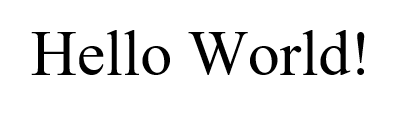<br><sub><b>a1.png</b> · `Hello World!` · 0.9974</sub> | 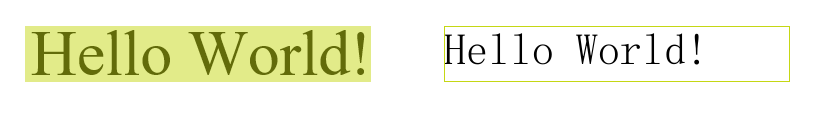 |
| 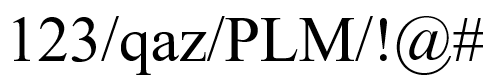<br><sub><b>a2.png</b> · `123/qaz/PLM/!@#` · 1.0000</sub> | 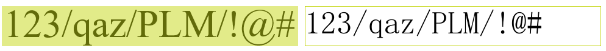 |
| 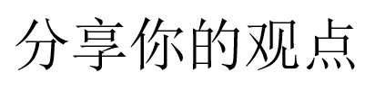<br><sub><b>a3.png</b> · `分享你的观点` · 1.0000</sub> | 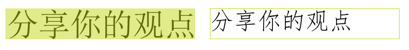 |
| 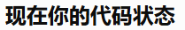<br><sub><b>a4.png</b> · `现在你的代码状态` · 0.9999</sub> |  |
| 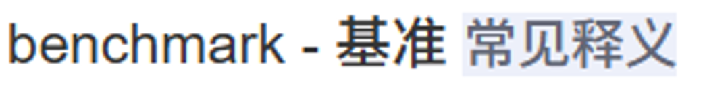<br><sub><b>a5.png</b> · `benchmark - 基准常见释义` · 0.9779</sub> |  |
| 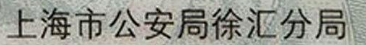<br><sub><b>a6.png</b> · `上海市公安局徐汇分局` · 1.0000</sub> | 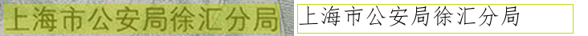 |
| 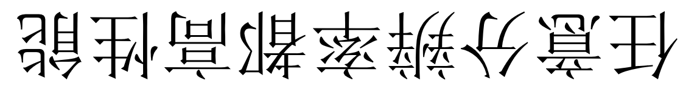<br><sub><b>a7.png</b> · `任意分辨率都高性能` · 0.9999</sub> |  |
| 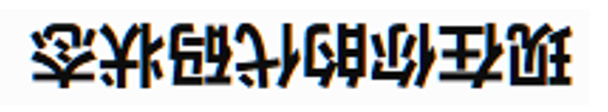<br><sub><b>a8.png</b> · `现在你的代码状态` · 0.9999 · 倒置输入，cls 自动矫正</sub> |  |
| <br><sub><b>a9.png</b> · `百度Ai+百度Ai+` · 0.9818</sub> |  |
| <br><sub><b>a10.png</b> · `电子健康码` · 1.0000</sub> | 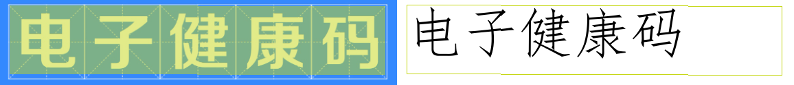 |

### Group B · 真实文档 / 截图 (b1–b10)

Real-world material — UI screenshots, news lists, long paragraphs, ID card, passport, shell output.

| 输入 (`benchmark/`) | 识别结果 (`output/`) |
|:---:|:---:|
| 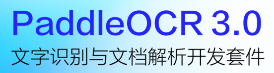<br><sub><b>b1.png</b> · `PaddleOCR3.0` · `文字识别与文档解析开发套件`</sub> | 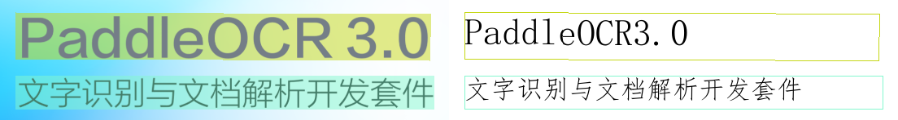 |
| 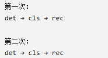<br><sub><b>b2.png</b> · `第一次：det → cls → rec` · `第二次：det → cls → rec`</sub> | 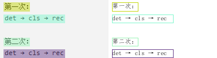 |
| 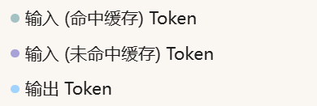<br><sub><b>b3.png</b> · `输入 (命中缓存) Token` / `输入 (未命中缓存) Token` / `输出 Token`</sub> | 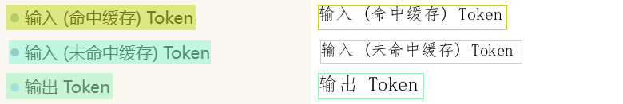 |
| 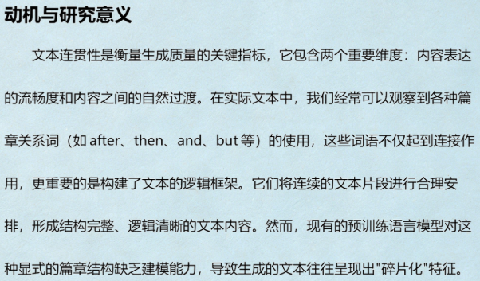<br><sub><b>b4.png</b> · 学术段落 6 行（`动机与研究意义` …），逐行识别</sub> | 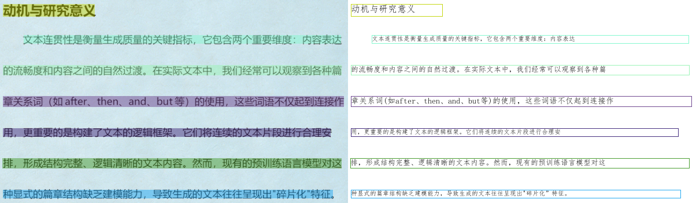 |
| 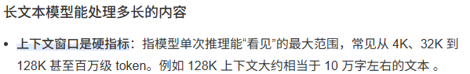<br><sub><b>b5.png</b> · `长文本模型能处理多长的内容` + 3 行长段落</sub> | 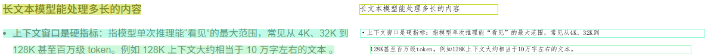 |
| 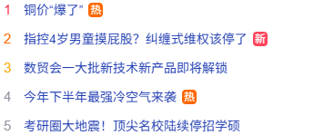<br><sub><b>b6.png</b> · 新闻热搜列表 5 条（`1 铜价"爆了"热` …）</sub> | 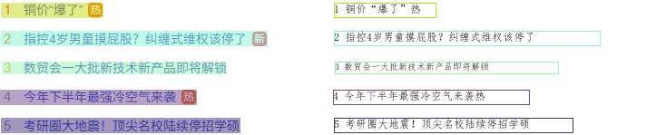 |
| 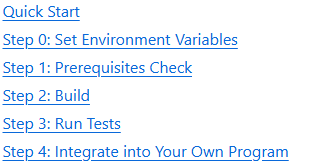<br><sub><b>b7.png</b> · `Quick Start` + `Step 0`–`Step 4` 共 6 行</sub> | 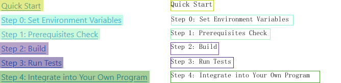 |
| 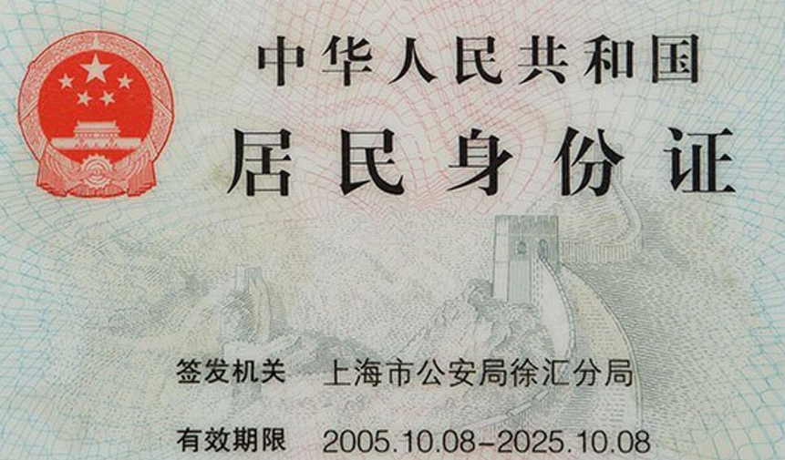<br><sub><b>b8.png</b> · 身份证：`中华人民共和国` · `居民身份证` · `签发机关上海市公安局徐汇分局` · `有效期限 2005.10.08-2025.10.08`</sub> |  |
| 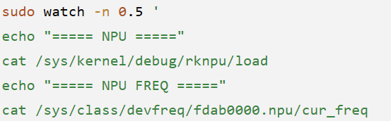<br><sub><b>b9.png</b> · shell 脚本：`sudo watch -n 0.5` · `echo "===== NPU ====="` · `cat /sys/kernel/debug/rknpu/load` · `cat /sys/class/devfreq/fdab0000.npu/cur_freq`</sub> |  |
| 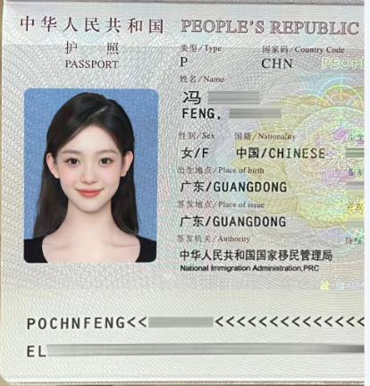<br><sub><b>b10.jpg</b> · 护照：`中华人民共和国` · `护照 PASSPORT` · `姓名/Name` · `签发机关/Authority` …（MRZ 也识别出 `POCHNFENG<<`）</sub> | 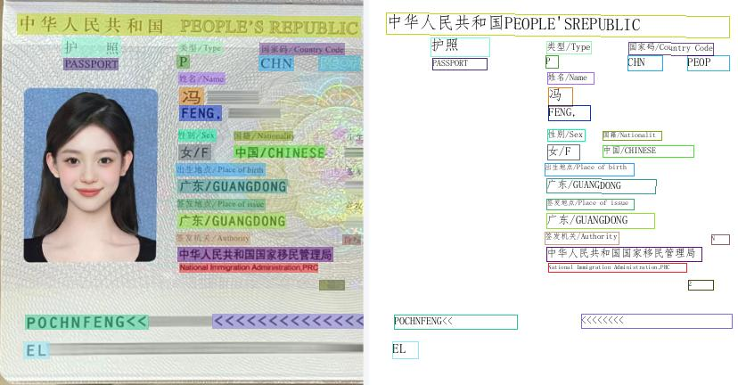 |

### Group C · 大字号 / 复杂版式 (c1–c9)

Large display type, multi-line layouts, rotation and partial occlusion.

| 输入 (`benchmark/`) | 识别结果 (`output/`) |
|:---:|:---:|
| 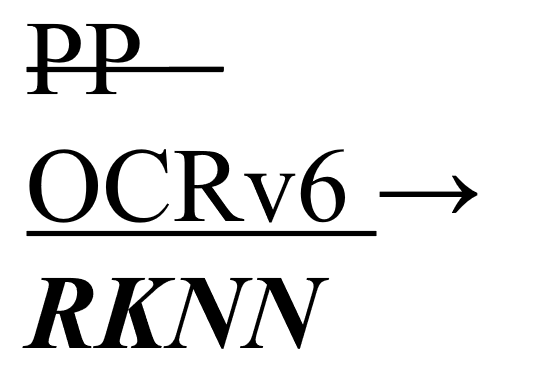<br><sub><b>c1.png</b> · `PP` · `OCRv6 →` · `RKNN`</sub> | 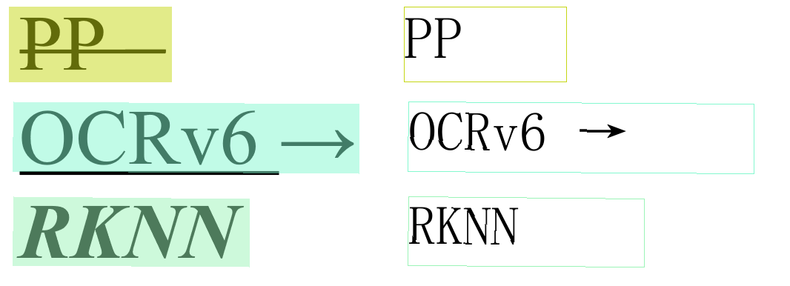 |
| 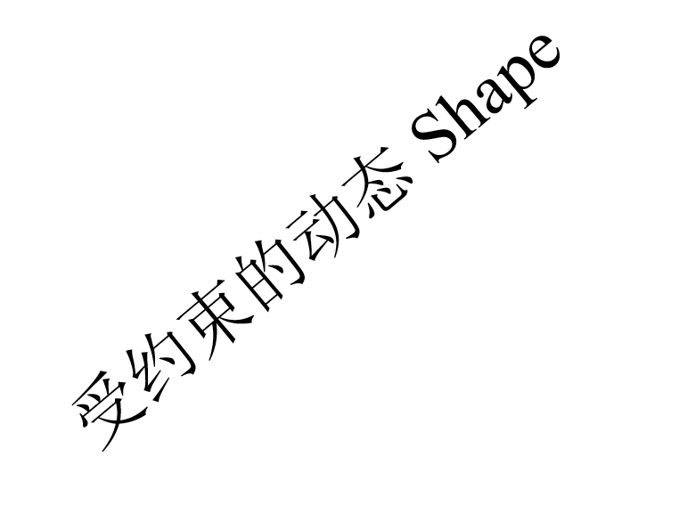<br><sub><b>c2.png</b> · `受约束的动态 Shape` · 0.9709</sub> | 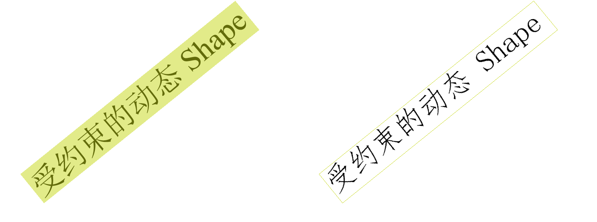 |
| 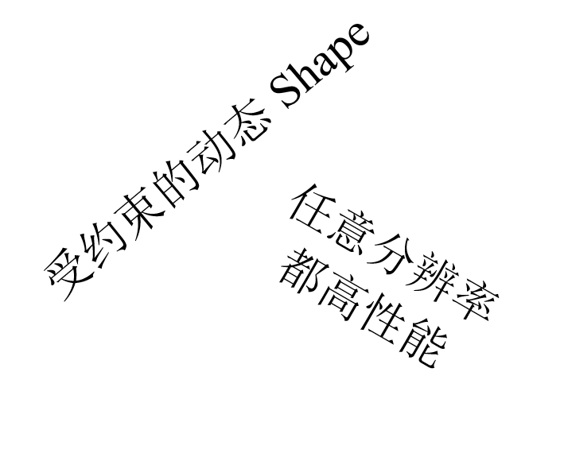<br><sub><b>c3.png</b> · `任意分辨率` · `都高性能` · `受约束的动态 Shape`</sub> | 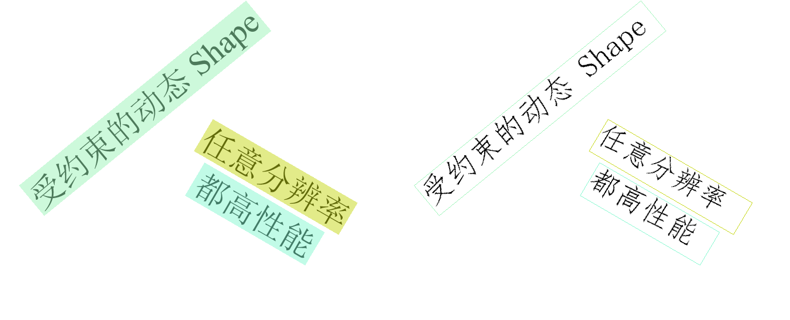 |
| 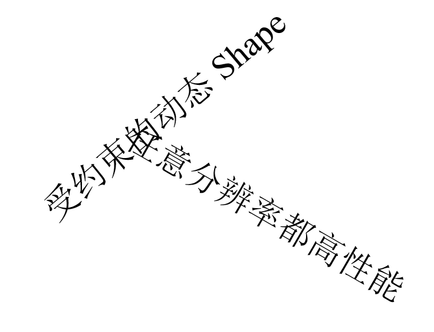<br><sub><b>c4.png</b> · `意分辨率都高性能` · `受约束的动态 Shape`（首字被裁切）</sub> | 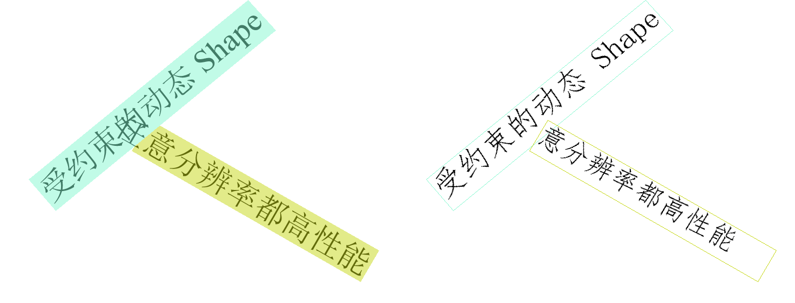 |
| 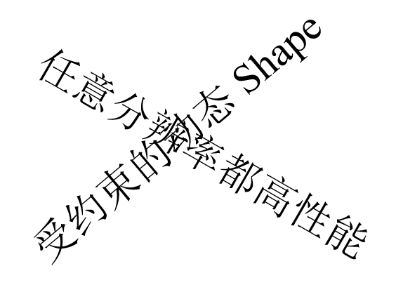<br><sub><b>c5.png</b> · `任意分` · `态 Shape` · 旋转 + 遮挡下的部分召回</sub> | 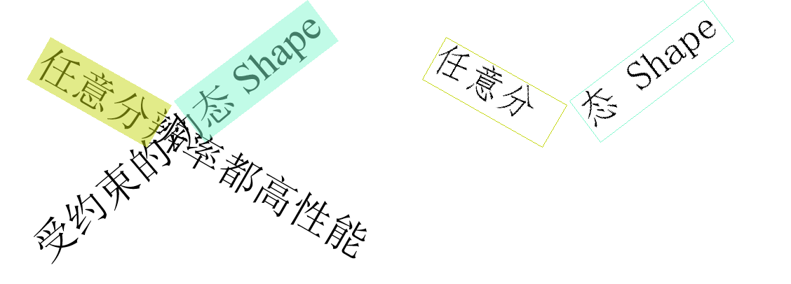 |
| 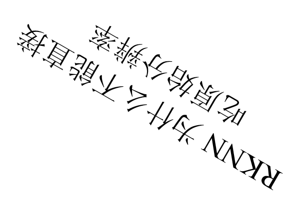<br><sub><b>c6.png</b> · `RKNN为什么不能直接` · `吃原始分辨率`</sub> | 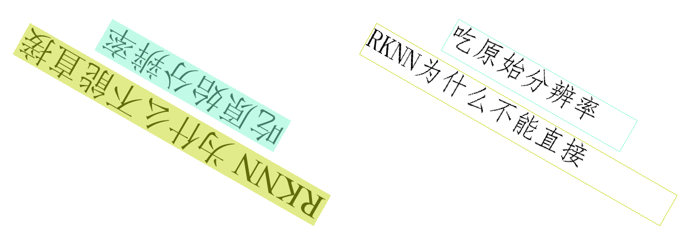 |
| 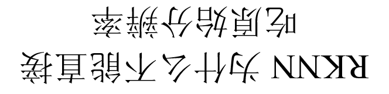<br><sub><b>c7.png</b> · `RKNN为什么不能直接` · `吃原始分辨率`（旋转版）</sub> | 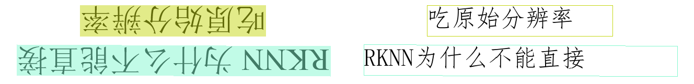 |
| 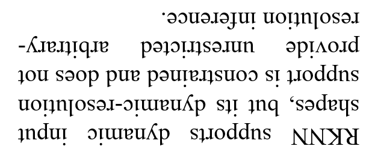<br><sub><b>c8.png</b> · 英文 7 行：`RKNN supports dynamic input` · `shapes, but its dynamic-resolution` · `support is constrained and does not` …</sub> | 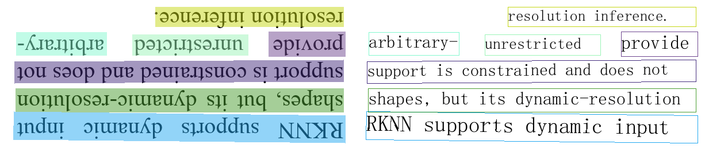 |
| 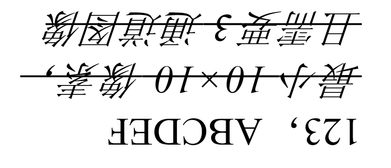<br><sub><b>c9.png</b> · `最小10×10像素，且需要3通道图像` · `123，ABCDEF`</sub> | 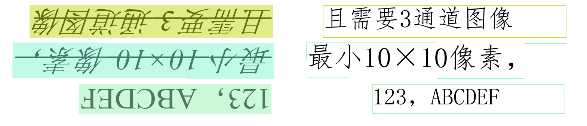 |

> **Note:** Confidence values come from a single run of `python ocr_infer.py`; see `ocr_infer.log` for the raw
> per-line output. Low-confidence detections on the passport (e.g. `N` 0.4839, `<<<<<<<<` 0.5080) show how
> the score helps you filter noise.

---

## 📂 Project Structure

```
PP-OCRv6/
├── ocr_infer.py              # Main inference entry: single-image + batch recognition with timing
├── onnx2rknn.py              # ONNX → RKNN conversion script
├── requirements.txt          # Python dependencies
│
├── benchmark/                # Test image set (29 images: a1-a10, b1-b10, c1-c9)
├── output/                   # Recognition result images (bounding boxes + recognized text)
│
└── models/
    ├── official_models/      # PaddlePaddle / ONNX official models
    │   ├── PP-OCRv6_medium_det/         # Text detection model
    │   ├── PP-OCRv6_medium_rec/         # Text recognition model
    │   └── PP-LCNet_x1_0_textline_ori/  # Textline orientation classifier
    └── rknn/                 # Converted .rknn models (det.rknn, cls.rknn, rec.rknn)
```

**Model roles:**

| Abbreviation | Full Name | Purpose |
|:---:|---------|---------|
| `det` | Text Detection | Locates text regions in the image and outputs bounding boxes |
| `cls` | Textline Orientation Classification | Determines if a text line is rotated 180° and corrects it |
| `rec` | Text Recognition | Reads the text content within each detected region |

---

## ⚡ Quick Start

### 📦 Prerequisites

```bash
pip install paddleocr onnxruntime
```

### 🖼️ Single Image Inference

```bash
python ocr_infer.py
```

By default, this runs inference on `benchmark/a1.png` and outputs:
- Per-text bounding box coordinates, recognized text, and confidence score
- Total inference time for the image
- Result visualization saved to `output/a1_ocr_res_img.png`

### 📂 Batch Inference

The script automatically scans `benchmark/` for `*.png / *.jpg / *.jpeg / *.bmp` files and processes them sequentially:

```bash
python ocr_infer.py
```

**Output format:**

```
文件名: a1.png
采样时间: 0.2341s
  文本: 你好, 坐标: [[...]], 置信度: 0.9876

共 29 张图片，开始循环识别...

文件名: a2.png
采样时间: 0.1987s
  文本: 测试文本, 坐标: [[...]], 置信度: 0.9532
  ...

总耗时: 4.3728s，平均一张图采样时间: 0.2186s
```

**Key behaviors:**
- Each image is processed independently via `ocr.predict()`
- Per-image timing, detected text, bounding boxes, and confidence scores are printed
- Final summary shows total elapsed time and average time per image
- Result images with overlaid bounding boxes are saved to `output/`

---

## 🔄 RKNN Conversion

Convert ONNX models to Rockchip RKNN format for NPU-accelerated edge inference.

**Supported platforms:** `rk3562`, `rk3566`, `rk3568`, `rk3576`, `rk3588`

### 📦 Install RKNN Toolkit

```bash
pip install rknn-toolkit2   # PC-side (x86_64) compilation environment
```

### 🚀 Basic Usage

```bash
# Convert all three models (default: RK3588, float precision)
python onnx2rknn.py

# Convert specific models only
python onnx2rknn.py --model det rec

# INT8 quantization (requires calibration dataset)
python onnx2rknn.py --platform rk3588 --dtype i8 --dataset ./calib_data.txt

# Float mode (default)
python onnx2rknn.py --platform rk3588 --dtype fp
```

### 📋 Script Parameters

| Parameter | Default | Description |
|-----------|---------|-------------|
| `--platform` | `rk3588` | Target Rockchip chip platform |
| `--dtype` | `fp` | Quantization type: `fp` (float), `i8` (INT8), `u8` (UINT8) |
| `--dataset` | `""` | Calibration dataset path (required for `i8`/`u8` quantization) |
| `--model` | `det cls rec` | Which models to convert |
| `--output_dir` | `models/rknn` | Output directory for `.rknn` files |

### 📐 Dynamic Input Configuration

Different models require different input shape strategies:

```python
# det (detection): fully dynamic, common resolution tiers
[[1, 3, 320, 320]], [[1, 3, 640, 640]]

# rec (recognition): fixed height 48, variable width
[[1, 3, 48, 160]], [[1, 3, 48, 320]], [[1, 3, 48, 640]]

# cls (classification): fixed input
[[1, 3, 80, 160]]
```

### ⚙️ Operator Handling

The `exSoftmax13` operator in the recognition model is offloaded to **CPU** to avoid NPU precision issues:

```python
OP_TARGET = {
    "det": None,
    "cls": None,
    "rec": {"exSoftmax13": "cpu"},
}
```

---

## 📥 Model Download

Models are automatically downloaded on first run via `paddleocr` and cached to `models/official_models/`:

```python
from paddleocr import PaddleOCR

ocr = PaddleOCR(
    text_detection_model_name="PP-OCRv6_medium_det",
    text_recognition_model_name="PP-OCRv6_medium_rec",
    use_textline_orientation=True,
)
```

| Model | Link |
|-------|------|
| PP-OCRv6_medium_det | [PaddleOCR Docs](https://paddlepaddle.github.io/PaddleOCR/latest/quick_start.html) |
| PP-OCRv6_medium_rec | [PaddleOCR Docs](https://paddlepaddle.github.io/PaddleOCR/latest/quick_start.html) |
| PP-LCNet_x1_0_textline_ori | [PaddleOCR Docs](https://paddlepaddle.github.io/PaddleOCR/latest/quick_start.html) |

---

## 🛠️ Tech Stack

| Component | Role |
|-----------|------|
| **PaddleOCR v6** | OCR pipeline (detection + orientation classification + recognition) |
| **ONNX Runtime** | CPU-side inference engine for PC preview |
| **RKNN Toolkit2** | Rockchip NPU model compilation and runtime |
| **PP-OCRv6_medium** | Balanced accuracy/speed mid-size model from PaddlePaddle |

---

<div align="center">

## 📄 License

[Apache 2.0](https://github.com/PaddlePaddle/PaddleOCR/blob/main/LICENSE)

</div>
